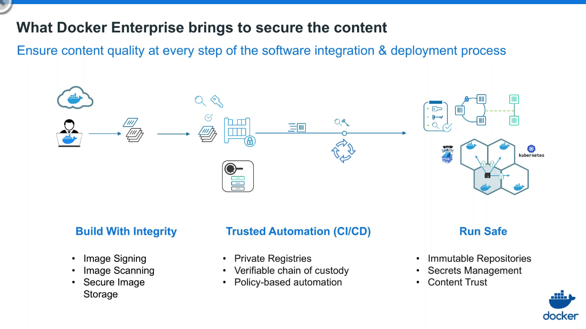

# La plateforme Docker Enterprise Edition
[Webinar](https://goto.docker.com/Webinaire-Series-On-Demand.html?aliId=262683773 "Tout ce que vous devez savoir sur la plateforme Docker Enterprise")

---
Docker Enterprise Edition est une solution de conteneurisation destinée aux entreprises, elle dispose de fonctionnalités étendues par rapport au - bien connu - Docker Engine et déploie une plate-forme de conteneurisation.
Son but est d'accompagner les organisations afin de moderniser leurs infrastructures applicatives en intégrant des fonctionnalités critiques pour les entreprises telle que notamment la sécurité et à la gouvernance.

### Respect de 3 piliers :
  - __choix__ : liberté opérationnelle des outils (CLI/Web UI), des orchestrateurs (Swarm/Kubernetes), des images (OS, applications), du type de cloud
  - __sécurité__ : authentification, rôles, encryption, sécurité des images via des signatures et des scans de vulnérabilités
  - __agilité__ : interopérabilité, automatisation, accélération des déploiements d’applications et de leur mise à jour dans un cycle continu

### Tarification :
Facturation au nombre de nœuds du cluster
3 versions :
 - basique
 - standard
 - advanced

2 niveaux de support :
 - en jours ouvrés
 - en 24/24h

### Certification :
- formations gratuites en ligne: [playwithdocker](https://training.play-with-docker.com/), [playwithkubernetes](https://training.play-with-kubernetes.com/)
- formations en classe orientées production
- certifications diplômantes en ligne

### Les outils de Docker Enterprise Edition (EE) :
- __Universal Control Plane (UCP)__: web console unifiée, permet de manager des clusters qui s'exécutent sur Swarm ou sur Kubernetes
- __Docker Trusted Registry (DTR)__ : DockerHub privatif sécurisé
- __CLI__ : le  __Client Bundle__  permet d'instancier un environnement pour les outils standard `docker` et `kubectl`
- __Docker Bench for Security__ : outil d'audit de vulnérabilité du Docker Engine
- __Docker Application Converter__: DAC est une application qui va détecter les applications d'une machine monolithique virtuelle ou baremétal pour les "Dockériser"
- __Docker Application Designer__: permet créer des containers sans écrire une seule ligne de code de manière totalement transparente sans besoin de formation à Docker
---

## Épisode 1 : vue d’ensemble

### Container :
 Dans Docker Enterprise, il est bien de revenir sur la définition du container qui n'est pas une grosse brique logicielle difficile à manipuler (image des containers sur les cargos) mais plutôt un paquet portable, léger et flexible. En anglais : `a lightweight portable package that isolate software component`

### Les différentes versions de Docker :
  - moby project : framework opensource pour les contributeurs
  - docker desktop & engine : outil gratuit de distribution de containers pour les développeurs.
  - docker enterprise : plateforme d’exécution et de production de containers pour les entreprises.

### Fonctionnalités spécifiques :
Docker Enterprise est une plateforme adaptée à la production et au déploiement de containers en clusters, pour cela des fonctionnalités spécifiques au domaine des opérations ont été ajoutées:
  - __sécurité__ : contrôle de la qualité, contrôle des vulnérabilité des images, encryptions, certificats, 3rd parties contrôlées
  - __gouvernance__ : règles et droits d'accès et d'administration, responsabilités limitées sur les clusters de production, ...
  - __automatisation__ : orchestration, intégration avec le reste de la production, automatisation des logs, ...
  - __support et certification__ : support d'entreprise dédié, plug-ins et infrastructures certifiés

### Les 4 piliers de mise en production de Docker Enterprise :
  - __gouvernance__ : bonnes pratiques d'organisation autour de la mise en production, formation des développeurs, des opérateurs aux outils de conteneurisation
  - __plateforme__ : architecture des applications conteneurisées
  - __pipeline__ : méthodologie DevOps, optimisation des chaînes d'intégrations et de déploiements continus
  - __applications__

### Docker Enterprise architecture

2 outils complémentaires pour gérer la plateforme et les orchestrateurs:
  - __Universal Control Plane (UCP)__: manager de clusters docker qui s'exécute sur Swarm ou sur Kubernetes en apportant d'autres fonctionnalités que n'ont pas ces outils opensource :
    - une installation facilitée
    - une console d'administration
    - de la sécurité
    - du contrôle d'accès basé sur des rôles
    - l'isolation physique des applications
    - l'intégration avec des annuaires LDAP/ActiveDirectory
    - l'intégration avec le Data Center : logs, utilisateurs, etc ...

  

  - __Docker Trusted Registry (DTR)__ : cycle de vie des images Docker, DockerHub privatif sécurisé
    - interface graphique d'administration
    - redondance des images
    - sécurité des images : scanner de vulnérabilité, protection des images de production
    - règles de promotion des images : nombre de vulnérabilités critiques
    - usage du repository:
      ```bash
      docker login dtr.xxx.docker-ee.com
      docker tag nginx dtr.xxx.docker-ee.com/dev/portal:dev
      docker push dtr.xxx.docker-ee.com/dev/portal:dev
       ```

  

### Sécurité de la chaîne de déploiement
3 catégories de sécurisation :
  - secure platform : certificats électroniques, encryption
  - secure content : qualité des images (scanner de vulnérabilité, signature des images)
  - secure access : authentification et sécurisation de la connection des administrateurs

---
## Épisode 2 : liberté opérationnelle
Une liberté de choix pour le déploiement des applications, sans crainte d’un verrouillage sur une technologie ou une infrastructure. Les organisations peuvent démarrer leurs projets, quelle que soit leur importance, avec des applications existantes ou de nouvelles applications, quel que soit le schéma opérationnel, quel que soit l’OS, au sein de tout type d’infrastructure, on premise ou en environnement multicloud, sans impact sur les déploiements des conteneurs.


### Docker Certified Infrastructures :
Docker EE supporte différents Cloud Providers:
  - VMWare
  - AWS
  - MS Azure
  - Google Cloud (soon)
  - IBM Cloud (soon)

Docker EE supporte différents OS :
  - Windows Server
  - Ubuntu / CentOS / RedHat / Suse / Oracle Linux (pas de Debian, ou de Fedora)

Grâce à des scripts de déploiement pre-cooked :
  - Terraform : creation des machines
  - Ansible : installation de Docker Enterprise

### Federated Application Management :
Interface graphique commune pour gérer les multiples plateformes de Cloud Containers et de VM Services qui permet de gérer les clusters Swarm et/ou Kubernetes, de déplacer/reconfigurer les applications.


Scénarios :

  * Utilisation de AKS,EKS,GKE pour déployer des applications, puis les rapatrier en local
  * Création de cluster Swarm, Kubernetes ou Mixte
  * Création de services

Docker EE apporte une interface graphique mais supporte aussi les commandes en ligne natives de docker et de kubectl via un __Client Bundle__ (certificats d'administration et shell scripts dans un .zip)

  ```shell
  # unzip du client bundle
  unzip file.zip

  # chargement de l'environnement Docker EE
  source env.sh

  # interrogation du démon docker déployé via Docker EE
  docker ps
  # déploiement de pods via le service kubernetes de Docker EE
  kubectl apply -f pod-jenkins.yml
  # verification des services
  kubectl get all
  ```
Résultats sur l'interface de Docker EE :


### Monitoring et logging d'applications
L'outil intégré dans EE est basé sur Prometheus Engine mais d'autres solutions peuvent être intégrées (MS OMS, SysDig, Splunk, ...)
Logging EFK & ELK

### Environnements de développement et de déploiement
Git Enterprise, GitLabs, Jenkins, Selenium, Visual Studio, Eclipse, TFS, etc

---
## Épisode 3 : La sécurité
Docker Enterprise offre une sécurité intégrée des conteneurs a chaque étape du cycle de vie des applications, sans impact sur les performances et sans coûts additionnels.

### Principaux composants de sécurité de Docker Enterprise

#### Secure platform:
  - sécurité de l'engine Docker : sécuriser les containers, les isoler les uns des autres
  - identité cryptographique validée par un certificat, toutes les communications entre les éléments Swarm ou Kubernetes sont cryptées en TLS
  - propre identité de certification de Docker mais possibilité d'utiliser les siens
  - rotation automatique des certificats
  - il est prouvé que les containers sont une technologie sécurisée : isolation avec NameSpaces, limitation des resources avec CGroups, administration des droits d'accès avec  LibCap, protection du kernel avec AppArmor, SELinux ou Seccomp, etc
  - les images sont en read-only donc ne peuvent pas être compromises, seul le container est writable donc la surface d'attaque est limitée

  - __Docker Bench for Security__ : outils d'audit de vulnérabilité du Docker Engine (disponible pour Docker CE également sans contrôle d'accès, en version mono utilisateur)

  Utilisation :

```shell
docker run -it --net host --pid host --userns host --cap-add audit_control \
  -e DOCKER_CONTENT_TRUST=$DOCKER_CONTENT_TRUST \
  -v /var/lib:/var/lib \
  -v /var/run/docker.sock:/var/run/docker.sock \
  -v /usr/lib/systemd:/usr/lib/systemd \
  -v /etc:/etc --label docker_bench_security \
  docker/docker-bench-security
...
Status: Downloaded newer image for docker/docker-bench-security:latest
# ------------------------------------------------------------------------------
# Docker Bench for Security v1.3.4
#
# Docker, Inc. (c) 2015-
#
# Checks for dozens of common best-practices around deploying Docker containers in production.
# Inspired by the CIS Docker Community Edition Benchmark v1.1.0.
# ------------------------------------------------------------------------------

Initializing Wed Feb 13 09:32:12 UTC 2019


[INFO] 1 - Host Configuration
[WARN] 1.1  - Ensure a separate partition for containers has been created
[NOTE] 1.2  - Ensure the container host has been Hardened
[INFO] 1.3  - Ensure Docker is up to date
[INFO]      * Using 18.06.1, verify is it up to date as deemed necessary
[INFO]      * Your operating system vendor may provide support and security maintenance for Docker
[INFO] 1.4  - Ensure only trusted users are allowed to control Docker daemon
[INFO]      * docker:x:137:username
[WARN] 1.5  - Ensure auditing is configured for the Docker daemon
[WARN] 1.6  - Ensure auditing is configured for Docker files and directories - /var/lib/docker
[WARN] 1.7  - Ensure auditing is configured for Docker files and directories - /etc/docker
[INFO] 1.8  - Ensure auditing is configured for Docker files and directories - docker.service
[INFO]      * File not found
[INFO] 1.9  - Ensure auditing is configured for Docker files and directories - docker.socket
[INFO]      * File not found
[WARN] 1.10  - Ensure auditing is configured for Docker files and directories - /etc/default/docker
[INFO] 1.11  - Ensure auditing is configured for Docker files and directories - /etc/docker/daemon.json
[INFO]      * File not found
[INFO] 1.12  - Ensure auditing is configured for Docker files and directories - /usr/bin/docker-containerd
[INFO]      * File not found
[INFO] 1.13  - Ensure auditing is configured for Docker files and directories - /usr/bin/docker-runc
[INFO]      * File not found


[INFO] 2 - Docker daemon configuration
[WARN] 2.1  - Ensure network traffic is restricted between containers on the default bridge
[PASS] 2.2  - Ensure the logging level is set to -info-
[PASS] 2.3  - Ensure Docker is allowed to make changes to iptables
[PASS] 2.4  - Ensure insecure registries are not used
[WARN] 2.5  - Ensure aufs storage driver is not used
[INFO] 2.6  - Ensure TLS authentication for Docker daemon is configured
[INFO]      * Docker daemon not listening on TCP
[INFO] 2.7  - Ensure the default ulimit is configured appropriately
[INFO]      * Default ulimit does not appear to be set
[WARN] 2.8  - Enable user namespace support
[PASS] 2.9  - Ensure the default cgroup usage has been confirmed
[PASS] 2.10  - Ensure base device size is not changed until needed
[WARN] 2.11  - Ensure that authorization for Docker client commands is enabled
[WARN] 2.12  - Ensure centralized and remote logging is configured
[INFO] 2.13  - Ensure operations on legacy registry (v1) are Disabled (Deprecated)
[WARN] 2.14  - Ensure live restore is Enabled
[WARN] 2.15  - Ensure Userland Proxy is Disabled
[PASS] 2.16  - Ensure daemon-wide custom seccomp profile is applied, if needed
[PASS] 2.17  - Ensure experimental features are avoided in production
[WARN] 2.18  - Ensure containers are restricted from acquiring new privileges


[INFO] 3 - Docker daemon configuration files
[INFO] 3.1  - Ensure that docker.service file ownership is set to root:root
[INFO]      * File not found
[INFO] 3.2  - Ensure that docker.service file permissions are set to 644 or more restrictive
[INFO]      * File not found
[INFO] 3.3  - Ensure that docker.socket file ownership is set to root:root
[INFO]      * File not found
[INFO] 3.4  - Ensure that docker.socket file permissions are set to 644 or more restrictive
[INFO]      * File not found
[PASS] 3.5  - Ensure that /etc/docker directory ownership is set to root:root
[PASS] 3.6  - Ensure that /etc/docker directory permissions are set to 755 or more restrictive
[INFO] 3.7  - Ensure that registry certificate file ownership is set to root:root
[INFO]      * Directory not found
[INFO] 3.8  - Ensure that registry certificate file permissions are set to 444 or more restrictive
[INFO]      * Directory not found
[INFO] 3.9  - Ensure that TLS CA certificate file ownership is set to root:root
[INFO]      * No TLS CA certificate found
[INFO] 3.10  - Ensure that TLS CA certificate file permissions are set to 444 or more restrictive
[INFO]      * No TLS CA certificate found
[INFO] 3.11  - Ensure that Docker server certificate file ownership is set to root:root
[INFO]      * No TLS Server certificate found
[INFO] 3.12  - Ensure that Docker server certificate file permissions are set to 444 or more restrictive
[INFO]      * No TLS Server certificate found
[INFO] 3.13  - Ensure that Docker server certificate key file ownership is set to root:root
[INFO]      * No TLS Key found
[INFO] 3.14  - Ensure that Docker server certificate key file permissions are set to 400
[INFO]      * No TLS Key found
[PASS] 3.15  - Ensure that Docker socket file ownership is set to root:docker
[PASS] 3.16  - Ensure that Docker socket file permissions are set to 660 or more restrictive
[INFO] 3.17  - Ensure that daemon.json file ownership is set to root:root
[INFO]      * File not found
[INFO] 3.18  - Ensure that daemon.json file permissions are set to 644 or more restrictive
[INFO]      * File not found
[PASS] 3.19  - Ensure that /etc/default/docker file ownership is set to root:root
[PASS] 3.20  - Ensure that /etc/default/docker file permissions are set to 644 or more restrictive


[INFO] 4 - Container Images and Build File
[INFO] 4.1  - Ensure a user for the container has been created
[INFO]      * No containers running
[NOTE] 4.2  - Ensure that containers use trusted base images
[NOTE] 4.3  - Ensure unnecessary packages are not installed in the container
[NOTE] 4.4  - Ensure images are scanned and rebuilt to include security patches
[WARN] 4.5  - Ensure Content trust for Docker is Enabled
[WARN] 4.6  - Ensure HEALTHCHECK instructions have been added to the container image
[WARN]      * No Healthcheck found: [817926166193.dkr.ecr.eu-west-1.amazonaws.com/maven-repository:latest 817926166193.dkr.ecr.eu-west-1.amazonaws.com/maven-repository:v_1 username/maven:11]
[WARN]      * No Healthcheck found: [817926166193.dkr.ecr.eu-west-1.amazonaws.com/maven-repository:latest 817926166193.dkr.ecr.eu-west-1.amazonaws.com/maven-repository:v_1 username/maven:11]
[WARN]      * No Healthcheck found: [817926166193.dkr.ecr.eu-west-1.amazonaws.com/maven-repository:latest 817926166193.dkr.ecr.eu-west-1.amazonaws.com/maven-repository:v_1 username/maven:11]
[PASS] 4.7  - Ensure update instructions are not use alone in the Dockerfile
[NOTE] 4.8  - Ensure setuid and setgid permissions are removed in the images
[INFO] 4.9  - Ensure COPY is used instead of ADD in Dockerfile
[INFO]      * ADD in image history: [docker/docker-bench-security:latest]
[INFO]      * ADD in image history: [817926166193.dkr.ecr.eu-west-1.amazonaws.com/maven-repository:latest 817926166193.dkr.ecr.eu-west-1.amazonaws.com/maven-repository:v_1 username/maven:11]
[INFO]      * ADD in image history: [817926166193.dkr.ecr.eu-west-1.amazonaws.com/maven-repository:latest 817926166193.dkr.ecr.eu-west-1.amazonaws.com/maven-repository:v_1 username/maven:11]
[INFO]      * ADD in image history: [817926166193.dkr.ecr.eu-west-1.amazonaws.com/maven-repository:latest 817926166193.dkr.ecr.eu-west-1.amazonaws.com/maven-repository:v_1 username/maven:11]
[NOTE] 4.10  - Ensure secrets are not stored in Dockerfiles
[NOTE] 4.11  - Ensure verified packages are only Installed

[INFO] 5 - Container Runtime
[INFO]      * No containers running, skipping Section 5

[INFO] 6 - Docker Security Operations
[INFO] 6.1  - Avoid image sprawl
[INFO]      * There are currently: 3 images
[INFO] 6.2  - Avoid container sprawl
[INFO]      * There are currently a total of 3 containers, with 1 of them currently running


[INFO] 7 - Docker Swarm Configuration
[PASS] 7.1  - Ensure swarm mode is not Enabled, if not needed
[PASS] 7.2  - Ensure the minimum number of manager nodes have been created in a swarm (Swarm mode not enabled)
[PASS] 7.3  - Ensure swarm services are binded to a specific host interface (Swarm mode not enabled)
[PASS] 7.4  - Ensure data exchanged between containers are encrypted on different nodes on the overlay network
[PASS] 7.5  - Ensure Docker secret management commands are used for managing secrets in a Swarm cluster (Swarm mode not enabled)
[PASS] 7.6  - Ensure swarm manager is run in auto-lock mode (Swarm mode not enabled)
[PASS] 7.7  - Ensure swarm manager auto-lock key is rotated periodically (Swarm mode not enabled)
[PASS] 7.8  - Ensure node certificates are rotated as appropriate (Swarm mode not enabled)
[PASS] 7.9  - Ensure CA certificates are rotated as appropriate (Swarm mode not enabled)
[PASS] 7.10  - Ensure management plane traffic has been separated from data plane traffic (Swarm mode not enabled)

[INFO] Checks: 74
[INFO] Score: 8
```

#### Secure content

En résumé:
- repositories immutables dans DTR: read-only avec règles de promotion des images de développement
- scan de vulnérabilité des images avant exécution, après le push sur le repository
- politique de promotion d'images selon des règles (par ex. 0 vulnérabilité critique)
- les vulnérabilités des images sont décrites par couches pour permettre aux développeurs de les corriger
- détection des vulnérabilités par hash des binaires présents dans les couches des images (DTR met à jour sa base de signature régulièrement ou manuellement)

### Secure operations
Méchanisme :
- authentification des administrateurs
- integration with AD/LDAP : Admin Settings > Authentication & Authorization
- controle d'accès avancé aux clusters : isolation de noeuds (ex: isolation d'une application sur des noeuds donnés), à la fois en Swarm et en Kubernetes
- controle d'accès basé sur des rôles (RBAC):
  - roles : ensemble de droit d'accès
  - collection : ensemble de resources sur lequel on peut donner des droits d'accès, hiérachisée avec des sous collections
  - sujets : individus ou des équipes d'administration
  - grant : association d'un rôle à des sujets

Exemple pour la création d'un service et des ses droits d'accès :
- choix de l'image et configuration du service
- association à une collection
- définition des droits d'accès en tant qu'administrateur docker :
  - création de roles: par exemple: start-restart-role, avec des droits d'accès bien particuliers sur des actions sur les containers (logs, start, stop, view), services (log, view)
  - création du grant : on affecte à un sujet donné un role avec des droits donnés sur une collection donnée, par exemple : l'utilisateur operator n'aura le droit que de redémarrer un service faisant partie de la collection portail-de-production

 ---

## Épisode 4 : L'agilité
La plateforme Docker Enterprise offre une totale agilité opérationnelle, qui permet l’accélération des déploiements d’applications et de leur mise à jour dans un cycle continu, celle de l’interopérabilité et enfin celle de l’automatisation. Docker effectue la transition vers DevOps en connectant développeurs et opérations de façon concrète.

### Les atouts du container dans l'IT
- __Cloud Computing__ : cloud migration public/hybrid/privé, réversibilité
- __Modernisation des applications__ :  Docker EE réduit le time to market, 
- __DevOps__ : le container simplifie la mise en production, Docker EE optimise - l'intégration continuer
- __Réduction des coûts__ : moins de machines virtuelles pour des services et des fonctionnalité identiques, le nombre de cores nécessaires restent approximativement le même mais l'utilisation des CPU est moindre de par le fonctionnement en containers
- __Multiple possibilités de déploiement__ : Docker EE permet différents scénarios :
  - sur différents continents : déploiement offshore
  - mirroring de registries
  - caching sécurisé des images de développement en local
- __UCP__: un outil unique pour gérer tous ses clusters
- __Outils de migration__ des applications d'un environnement monolithique vers une architecture de containers :
  - [une version opensource](https://hub.docker.com/bundles/docker-application-converter) : non disponible pour test sans passer par les sales Docker  :(
  - une version propriétaire __Docker Application Converter__: DAC est une application qui va détecter les applications d'une machine monolithique virtuelle ou baremétal pour les "Dockériser"

- __Paradigme de l'universalité du packaging Docker__ : la complexité des chaines de déploiement logicielles est grandement simplifiée grâce aux containers, Build&Ship anywhere
- en cours de développement chez Docker : __Docker Application Designer__ vise à apporter plus de facilité dans l'usage des containers : créer des containers sans écrire une seule ligne de code de manière totalement transparente sans besoin de formation à Docker
  - exemple de création d'une application .net avec 2 containers : ASP .net et mssql sans aucune ligne de code. L'application est prête à l'emploi pour les développeurs
  - exemple de création d'une application Ruby on Rails avec 2 containers : rails et postgres

---

## Épisode 5 : Intégration de Kubernetes
L’orchestrateur Kubernetes est maintenant intégré à la plateforme Docker Enterprise. Cela signifie que les architectures Kubernetes bénéficient des différents modules de Docker Enterprise notamment les modules de sécurité. Cela permet notamment de répondre au mieux aux enjeux de l'IA et du serverless qui représentent actuellement deux des tendances majeures du cloud (tant public que privé).

### Swarm & Kubernetes 
Swarm et Kubernetes sont deux orchestrateurs qui fonctionnent en parallèle par défaut dans Docker EE : l'installation de Kubernetes est automatique.

- Les noeuds schedulers sont soit Swarm soit Kubernetes
- Les noeuds managers sont à la fois Swarm et Kubernetes
- Les noeuds workers sont soit Swarm, soit Kubernetes, soit mixte (non recommandé en prod)

Swarm : développé par Docker pour aider les devs à se servir des images disponibles sur le Hub, permet un assemblage rapide et simple d'applications

Kubernetes : développé par Google pour des déploiements complexes, des applications plus lourdes, intégré dans Docker EE ou Docker desktop sur Mac/Windows (pas sur Linux :( )

### Gestion simplifiée du cluster Kubernetes grâce à Swarm :
La commande de création à exécuter avec des tokens d'identification est  :

```shell
docker swarm join [OPTIONS] HOST:PORT
```

### Réseau
Dans Docker EE la pile réseau CNI Calico est installée automatiquement

### Contrôle d'accès
Les rôles Kubernetes sont disponibles dans Docker EE, mais Docker EE va au delà notamment au niveau de l'isolation physique au niveau des namespaces Kubernetes
Rôles prédéfinis et possibilité de créer de nouveaux rôles custom avec des règles d'opérations spécifiques aux containers, aux services, à Kubernetes et à Swarm
Namespaces Kubernetes et collections Docker EE peuvent être liés et être affectés à des noeuds particuliers.

### Console web et ligne de commande
Docker EE utilise les API et la CLI Kubernetes standard
On peut déployer des fichiers Docker Compose en ressources Kubernetes, à la place des YAML: le langage des Docker compose est plus simple que le YAML Kubernetes, la migration de Swarm vers Kubernetes est simplifiée

Sur la console Web, à la création du service on choisi le docker compose voulu, et on choisi le déploiement de type Kubernetes

En ligne de commande, on utilise le client bundle puis la commande `kubectl` :

  ```shell
  source env.sh
  kubectl get nodes
  kubectl get all
  # déploiement de pods & services
  kubectl apply -f conf.yml
  # suppression des ressources
  kubectl delete
  ```
---

## Épisode 6: Déploiement de Docker Enterprise en production: Méthodologie
Docker est très largement utilisé en développement et de plus en plus déployé en production dans les plus grandes entreprises dans le monde. Cela permet ainsi de faciliter et sécuriser les déploiement tout en permettant la montée en charge de vos applications.
  


