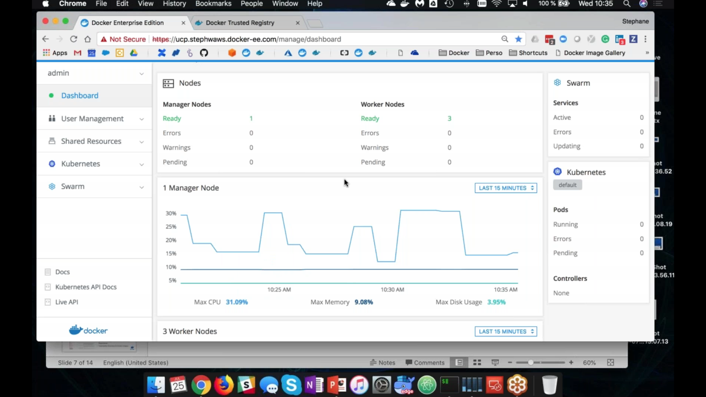
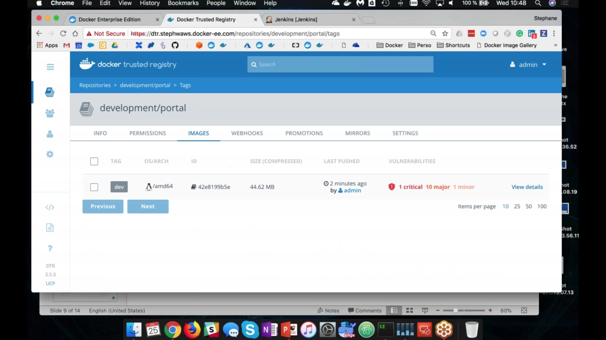

# La plateforme Docker Enterprise
[Webinar : Tout ce que vous devez savoir sur la plateforme Docker Enterprise.](https://goto.docker.com/Webinaire-Series-On-Demand.html?aliId=262683773)

Docker Enterprise Edition est une solution de conteneurisation destinée aux entreprises, elle dispose de fonctionnalités étendues par rapport au - bien connu - Docker Engine et déploie une plate-forme de conteneurisation.
Son but est d'accompagner les organisations afin de moderniser leurs infrastructures applicatives en intégrant des fonctionnalités critiques pour les entreprises telle que notamment la sécurité et à la gouvernance.

### Respect de 3 piliers :
  - __choix__ : liberté opérationnelle des outils (CLI/Web UI), des orchestrateurs (Swarm/Kubernetes), des images (OS, applications), du type de cloud
  - __sécurité__ : authentification, rôles, encryption, sécurité des images via des signatures et des scans de vulnérabilités
  - __agilité__ : interopérabilité, automatisation, accélération des déploiements d’applications et de leur mise à jour dans un cycle continu

### Tarification :
Facturation au nombre de nœuds du cluster
3 versions :
 - basique
 - standard
 - advanced

2 niveaux de support :
 - en jours ouvrés
 - en 24/24h

### Certification :
- formations gratuites en ligne: [playwithdocker](https://training.play-with-docker.com/), [playwithkubernetes](https://training.play-with-kubernetes.com/)
- formations en classe orientées production
- certifications diplômantes en ligne

---

## Épisode 1 : Vue d’ensemble de la plateforme Docker Enterprise

### Container :
 Dans Docker Enterprise, il est bien de revenir sur la définition du container qui n'est pas une grosse brique logicielle difficile à manipuler (image des containers sur les cargos) mais plutôt un paquet portable, léger et flexible. En anglais : `a lightweight portable package that isolate software component`

### Les différentes versions de Docker :
  - moby project : framework opensource pour les contributeurs
  - docker desktop & engine : outil gratuit de distribution de containers pour les développeurs.
  - docker enterprise : plateforme d’exécution et de production de containers pour les entreprises.

### Fonctionnalités spécifiques :
Docker Enterprise est une plateforme adaptée à la production et au déploiement de containers en clusters, pour cela des fonctionnalités spécifiques au domaine des opérations ont été ajoutées:
  - __sécurité__ : contrôle de la qualité, contrôle des vulnérabilité des images, encryptions, certificats, 3rd parties contrôlées
  - __gouvernance__ : règles et droits d'accès et d'administration, responsabilités limitées sur les clusters de production, ...
  - __automatisation__ : orchestration, intégration avec le reste de la production, automatisation des logs, ...
  - __support et certification__ : support d'entreprise dédié, plug-ins et infrastructures certifiés

### Les 4 piliers de mise en production de Docker Enterprise :
  - __gouvernance__ : bonnes pratiques d'organisation autour de la mise en production, formation des développeurs, des opérateurs aux outils de conteneurisation
  - __plateforme__ : architecture des applications conteneurisées
  - __pipeline__ : méthodologie DevOps, optimisation des chaînes d'intégrations et de déploiements continus
  - __applications__

### Docker Enterprise architecture

2 outils complémentaires pour gérer la plateforme et les orchestrateurs:
  - __Universal Control Plane (UCP)__: manager de clusters docker qui s'exécute sur Swarm ou sur Kubernetes en apportant d'autres fonctionnalités que n'ont pas ces outils opensource :
    - une installation facilitée
    - une console d'administration
    - de la sécurité
    - du contrôle d'accès basé sur des rôles
    - l'isolation physique des applications
    - l'intégration avec des annuaires LDAP/ActiveDirectory
    - l'intégration avec le Data Center : logs, utilisateurs, etc ...

  

  - __Docker Trusted Registry (DTR)__ : cycle de vie des images Docker, DockerHub privatif sécurisé
    - interface graphique d'administration
    - redondance des images
    - sécurité des images : scanner de vulnérabilité, protection des images de production
    - règles de promotion des images : nombre de vulnérabilités critiques
    - usage du repository:
      ```bash
      docker login dtr.xxx.docker-ee.com
      docker tag nginx dtr.xxx.docker-ee.com/dev/portal:dev
      docker push dtr.xxx.docker-ee.com/dev/portal:dev
       ```

  

### Sécurité de la chaîne de déploiement
3 catégories de sécurisation :
  - secure platform : certificats électroniques, encryption
  - secure content : qualité des images (scanner de vulnérabilité, signature des images, )
  - secure access : authentification et sécurisation de la connection des administrateurs
